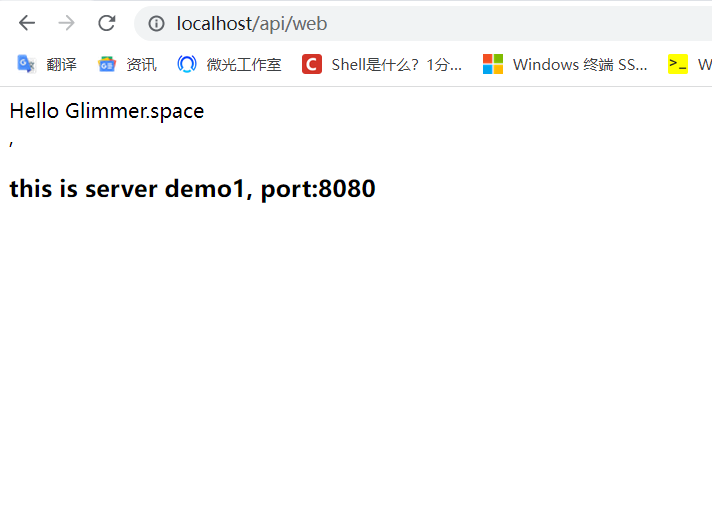

# README

1. 首先你需要下载一个JDK，并配置一下环境变量

   JDK下载地址：https://www.oracle.com/java/technologies/downloads/

2. 这里提供了两个jar包，demo-1.jar和demo-2.jar

   启动方式是在jar包的对应目录下：

   ```
   java -jar demo-1.jar
   ```

3. 启动完后，在浏览器输入http://localhost:8080/api/web，可以看到如下界面（以demo-1.jar为例）

   

